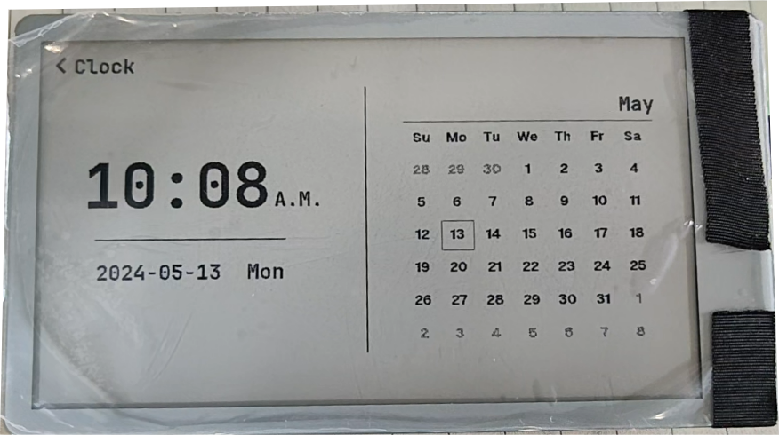
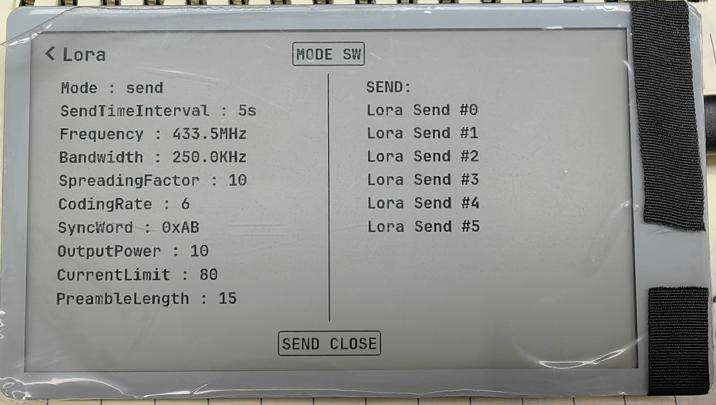
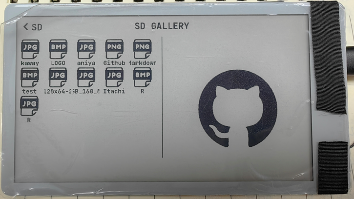
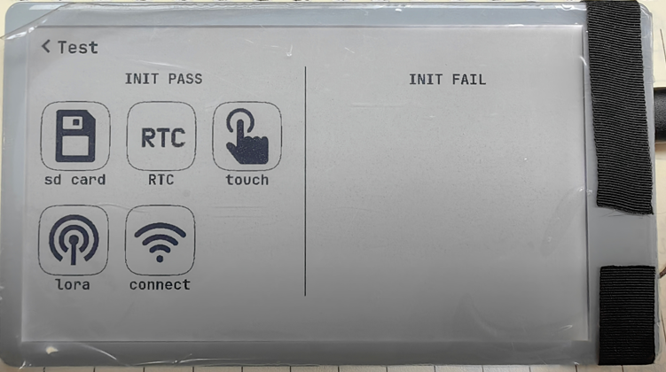

<h1 align = "center">🏆T-EPD47-S3🏆</h1>

 
  
  
  
  

* [Switch to English](./README.md)

## :one:Product 🎁
| Version |    v1.0 24-04-20    |
|:-------:|:-------------------:|
|  模块   |  ESP32-S3-WROOM-1   |
|  Flash  |        16MB         |
|  PSRAM  |         8MB         |
|  屏幕   | 960x540 16灰 墨水屏  |

## :two:快速开始 🎁
首先配置WIFI，在文件 `examples\display_demo\display_demo.h` 下更改关于 WIFI 名和密码的宏定义，将下面的宏改为你自己的 WIFI 名和密码；
~~~c
#define WIFI_SSID "Your WiFi SSID"
#define WIFI_PASSWORD "Your WiFi PASSWORD"
~~~

### 2.1 使用 PlatformIO

工程使用 PlatformIO 开发，只要 clone 代码，编译下载就可以运行了；

如何你是第一个使用 PlatformIO，你可尝试下面步骤来安装 PlatformIO：

例如：[PlatformIO 环境安装](https://zhuanlan.zhihu.com/p/509527710)

1. 安装 [VScode]((https://code.visualstudio.com/)) 和 [Python](https://www.python.org/)，并且克隆或下载此项目；
2. 在 VScode 的扩展中搜索 PlatformIO 的插件，然后安装它；
3. 在 PlatformIO 插件安装完成后，需要重新启动 VScode，然后用 VScode 打开此工程；
4. 打开此工程后，PlatformIO 会自动的下载需要的三方库和依赖，第一次这个过程比较长，情耐心等待；
5. 当所有的依赖安装后，可以打开 `platformio.ini` 配置文件，在 `example` 中取消注释来选择一个例程，选择后按下 `ctrl+s` 保存 .ini 配置文件；
6. 点击 VScode 下面的 :ballot_box_with_check: 编译工程，然后插上 USB 在 VScode 下面选择 COM 口；
7. 最后点击 :arrow_right: 按键将程序下载到 Flash 中；

## 🔴🟡🟢 运行效果图

